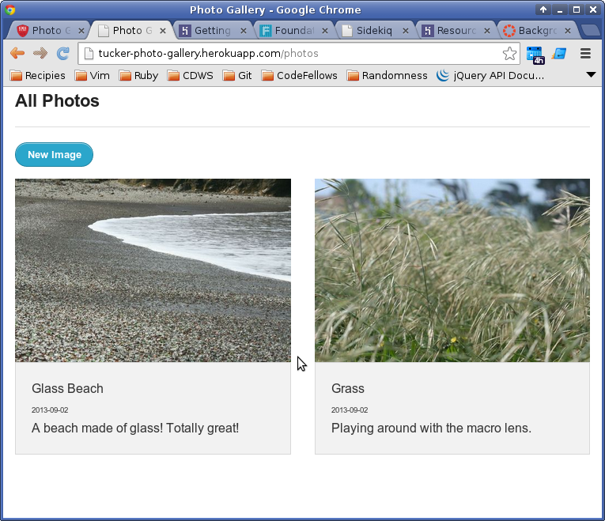
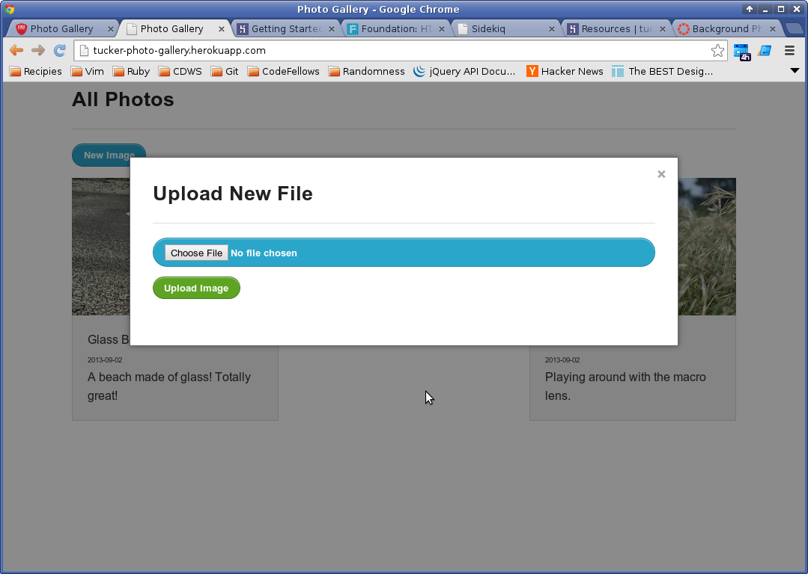
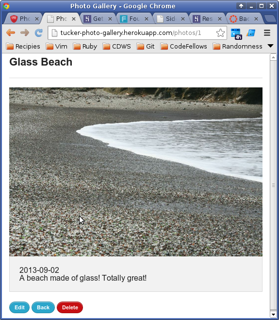

# Photo Gallery

By [Danielle Tucker](http://www.linkedin.com/in/dqtucker/).

## Description
**Photo Gallery** is a mini app to store family and trip photographs.

Running on Heroku: http://tucker-photo-gallery.herokuapp.com/

### Ideas Explored
- [Zurb Foundation](http://foundation.zurb.com/) styling
- Uploading photos with [CarrierWave](https://github.com/carrierwaveuploader/carrierwave) and [CarrierWave Direct](https://github.com/dwilkie/carrierwave_direct)
- Storage of photos in Amazon S3
- Background image resizing: [RMagick](https://github.com/dwilkie/carrierwave_direct), [Sidekiq](http://sidekiq.org/)

### To Do / Wishlist:
- Organize photos with tags
- Organize photos with flexible hierarchy structures
- Search photos via tags
- Pull metadata from photos for date/time taken and geo location
- Visualize photo location via geo location on google map (API use)

## Screenshots

Main Page (Thumbnails Processed in Background)

Adding New Images with Modal Window

View Details of Image (Full Size Image)

## Setup

Clone or Fork the project.

Set up the database: `rake db:setup`

You will need an Amazon S3 bucket:
- View [documentation](http://docs.aws.amazon.com/AmazonS3/latest/gsg/GetStartedWithS3.html) for setting up bucket.
- When you are done with creating a bucket put the key id, access key, and bucket name in a .env file.  .env_example has been provided for you.  Rename this file to .env and replace your information with the dummy variables on the first three lines

Redis is required for Sidekiq background jobs so should be installed. Check out [Railscast #366](http://railscasts.com/episodes/366-sidekiq) to see it in action and see example setup.

## Contributing

1. Fork it
2. Create your feature branch (`git checkout -b my-new-feature`)
3. Commit your changes (`git commit -am 'Add some feature'`)
4. Push to the branch (`git push origin my-new-feature`)
5. Create new Pull Request

## Known Issues

If you discover any bugs, feel free to create an issue on GitHub fork and
send a pull request.

## License

[MIT License](LICENSE.txt) Copyright 2013 Danielle Tucker
